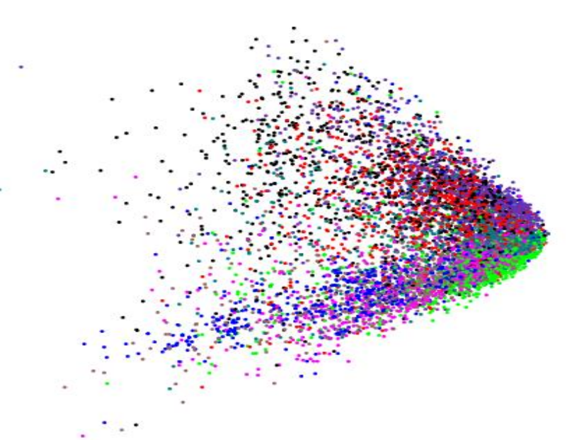
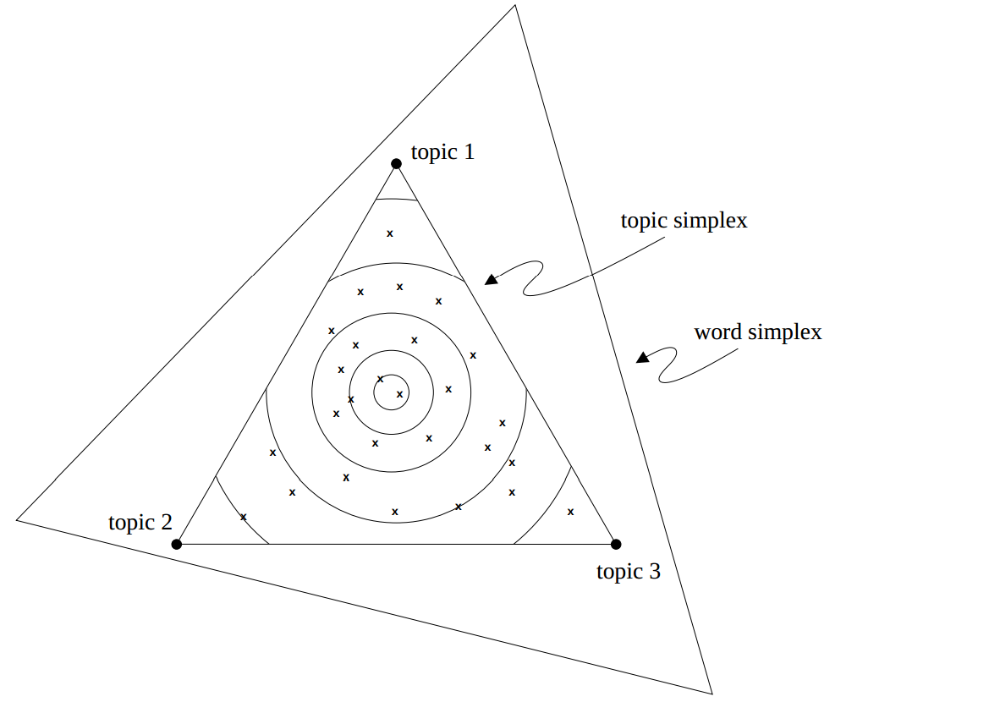
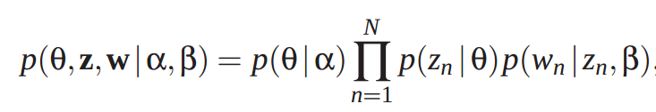
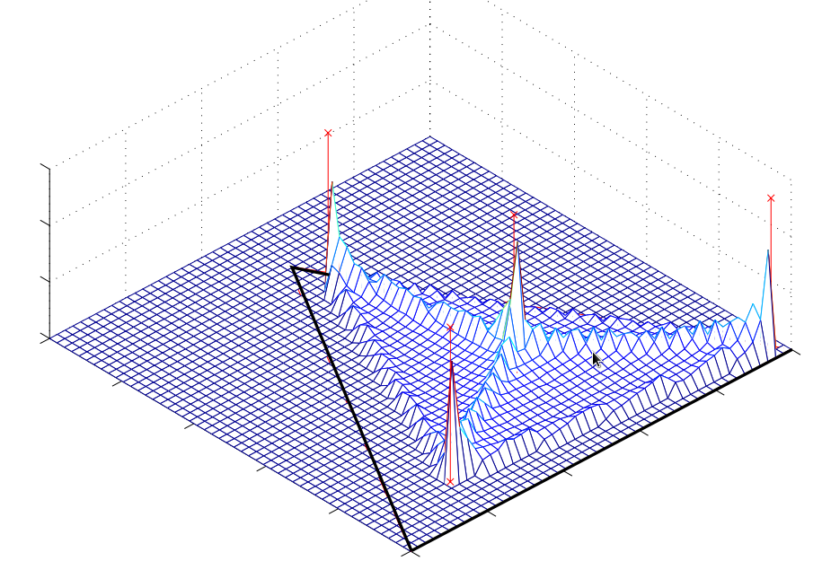

Topic Modeling Overview
==============================================

Motivating Example
=============================================

Topic Modeling is modeling the joint distribution of words with documents and
topics. Specify a number of topics, and words/documents will be clustered in to
different topics. The more topics you specify, the more finegrained the
categories become.

Topic modeling is for identifying the content of a corpus and providing a way of
automatically grouping content in meaningful ways. This allows you to do
everything from summarize content based on relevance to a topic, sentiment
analysis based on topic (is the topic positive or negative?) among any number of
things. You can also search by topic.

One typical use case is grouping news stories to identify what's relevant for
readers.

Reuters Newsgroup Visualization with PCA

Likelihood of a topic being in a given topic in a given document. Think of this
simplex as being able to pinpoint WHERE a given word falls within the word space
within the topic space.

Mathematically: What is it?
=====================================================

As mentioned earlier, it's modeling the joint distribution over words,
documents, and latent topics. This is in general an unsupervised way of grouping
documents relative to their word occurrences.

How does this tie in to what we did previously?
=======================================================================

You can run the same NLP pipeline (TFIDF vectorizer ring a bell?) and use those
bag of words vectors to automatically cluster documents in to topics.

LDA
=====================================

LDA is a generative model over a set of documents.

Documents are represented as a mixture over latent topics
wherein each topic is categorized over a distinct set of words (remember your
vocab?)

We can represent this probability distribution as follows:

Let theta represent the topic mixture over a set of documents over a set of N
topics z,
and a set of N words w.

If we remember the simplex from earlier, think of LDA as a way of placing points
on that triangle. The "allocation" part of the algorithm places the words in a 3
nested bin.

This can be represented with a simplex. Given a 3 edge simple with points A,B,
and C, let's demonstrate with a basically Dirchlet tries to find.

The basic idea is we have a triangle with 3 points, and we want to try to model
where the document falls over a set of topics given its words.

    from gensim.models.ldamodel import LdaModel
    from gensim import corpora
    from gensim import matutils
    from sklearn.feature_extraction.text import CountVectorizer
    from sklearn.datasets import fetch_20newsgroups
    from sklearn import linear_model
    import numpy as np
    newsgroups_train = fetch_20newsgroups(subset='train')
    vec = CountVectorizer(min_df=10, stop_words='english')
    
    X = vec.fit_transform(newsgroups_train.data)
    vocab = vec.get_feature_names()
    
    def fit_classifier(X, y, C=0.1):
        """ Fit L1 Logistic Regression classifier. """
        # Smaller C means fewer features selected.
        clf = linear_model.LogisticRegression(penalty='l1', C=C)
        clf.fit(X, y)
        return clf
     
    def fit_lda(X, vocab, num_topics=5, passes=20):
        """ Fit LDA from a scipy CSR matrix (X). """
        print 'fitting lda...'
        return LdaModel(matutils.Sparse2Corpus(X), num_topics=num_topics,
                        passes=passes,
                        id2word=dict([(i, s) for i, s in enumerate(vocab)]))
    
    def print_topics(lda, vocab, n=10):
        """ Print the top words for each topic. """
        topics = lda.show_topics(topics=-1, topn=n, formatted=False)
        for ti, topic in enumerate(topics):
            print 'topic %d: %s' % (ti, ' '.join('%s/%.2f' % (t[1], t[0]) for t in topic))
    
    def print_features(clf, vocab, n=10):
        """ Print sorted list of non-zero features/weights. """
        coef = clf.coef_[0]
        print 'positive features: %s' % (' '.join(['%s/%.2f' % (vocab[j], coef[j]) for j in np.argsort(coef)[::-1][:n] if coef[j] > 0]))
        print 'negative features: %s' % (' '.join(['%s/%.2f' % (vocab[j], coef[j]) for j in np.argsort(coef)[:n] if coef[j] < 0]))
    
    
    # Fit classifier.
    clf = fit_classifier(X, newsgroups_train.target)
    print_features(clf, vocab)
    
    # Fit LDA.
    lda = fit_lda(X, vocab)
    print_topics(lda, vocab)

    positive features: benedikt/1.52 atheism/1.50 okcforum/1.32 bmd/1.25 wwc/1.15 keith/1.10 jaeger/1.02 wingate/0.98 livesey/0.92 atheists/0.91
    negative features: organization/-0.50 usa/-0.43 mail/-0.40 rutgers/-0.39 ca/-0.35 thanks/-0.35 use/-0.31 line/-0.27 year/-0.25 10/-0.25
    fitting lda...
    topic 0: acknowledged/0.01 gnp/0.01 700/0.01 herman/0.01 confirmed/0.00 colorado/0.00 nigel/0.00 minutes/0.00 nodomain/0.00 ehrlich/0.00
    topic 1: nist/0.03 monninger/0.02 churchill/0.01 lookout/0.01 longer/0.01 cabell/0.01 french/0.01 clay/0.01 mutual/0.00 concerned/0.00
    topic 2: cuts/0.02 homers/0.02 continually/0.01 agnostic/0.01 kawasaki/0.01 hangs/0.01 differing/0.01 frequent/0.01 ke/0.01 csd4/0.01
    topic 3: discourse/0.10 military/0.09 mag/0.09 delta/0.08 demos/0.07 157/0.07 alarm/0.07 credibility/0.06 chassis/0.05 canadians/0.04
    topic 4: mock/0.01 hull/0.00 fw/0.00 institute/0.00 qy/0.00 dont/0.00 9mm/0.00 fallacy/0.00 alleged/0.00 davet/0.00

    
