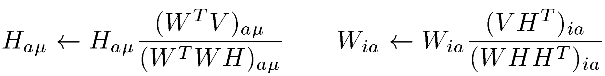

## Assignment: 

For this assignment, we will apply the NMF algorithm to our corpus of NYT articles to discover latent topics.  The NYT sections are great, but they are somewhat arbitrarily defined.  Let us see what insights we can mine out of our corpus!  


### NMF for the NYT Articles

1. We will be starting with our bag of words matrix.  You may use the [CountVectorizer](http://scikit-learn.org/stable/modules/generated/sklearn.feature_extraction.text.CountVectorizer.html) from scikit-learn (or Tfidf).  You have computed bag of words enough times to know it forwards and backwards.  Use the same 1405 articles we have been using all along now.

2. Use the scikit-learn NMF algorithm to compute the [Non-Negative Matrix factorization](http://scikit-learn.org/stable/auto_examples/applications/topics_extraction_with_nmf.html) of our documents.  Explore what "topics" are returned. 

3. The output may be hard to understand, but I recommend looking at the top features for each article and also the top words for each feature.

#### Interactive Plotting with Plotly.

Make a plotly account following these [instructions] (https://plot.ly/python/getting-started/) and remember your `username` and `api_key`.

Run the following code in your solution with your own username and api_key
    ```python
    import plotly.plotly as py
    from plotly import graph_objs
    py.sign_in('username', 'api_key')
    ```


1. Make a bar plot of the (top) words for each topic.  The x-axis should represent the word, and the y-axis should represent the value of each word in the topic.  This is similar to looking at the centroids from our kmeans clusters.


    <div>
        <a href="https://plot.ly/~rickyk9487/2/" target="_blank" title="Word Distributions for Topics of the NYT" style="display: block; text-align: center;"></a>
        <script data-plotly="rickyk9487:2" src="https://plot.ly/embed.js" async></script>
    </div>
    

1. To really understand the concept of topic space, try choosing 3 topics.  For a small subset of the documents plot it in "topic space" by creating a 3d scatterplot.  X, Y, Z will represent a row of the W weights matrix.

1. Can you add a title to each latent topic representing the words it contains?  Do these make sense given the articles with each topic?

1.  Now that you have hopefully labeled the latent features with what topics they represent, explore a few articles strongest latent features.  Do these make sense given the article?

1. Compare these results to what your results from kmeans / Hierarchical clustering (Week 5 Day 4).

1. How do the NYT sections compare to the topics from the unsupervised learning?  What are the differences?  And why do you think these exist?

#### Extra:  Word Cloud

Make a word cloud for each latent topic of the words contained in it.  You can use an online service or [Vega](https://github.com/trifacta/vega/blob/master/examples/spec/wordcloud.json) -- an awesome D3 library -- and it's Python library [Vincent](http://vincent.readthedocs.org/en/latest/index.html) (with sweet IPython [bindings](http://vincent.readthedocs.org/en/latest/quickstart.html#ipython-integration)). 

In the terminal, 

  ```
    sudo pip install vincent
    sudo npm install -g d3
  ```

Then in a python environment

  ```python
    
    import vincent
    vincent.core.initialize_notebook()
    for i in xrange(n_topics):
        word_cloud = vincent.Word(topic_dicts[i])
        ''' Your code here'''
        word_cloud.display()
  ```

----------


### Implementing NMF

0. Randomly initialize weights and features matrix
1. Compute difference between __W x H__ and our original matrix using cost function
2. Update __W__ and __H__
3. Repeat steps #1 and #2 until convergence (or max number of iterations)


With the document matrix (our bags of words), we can begin implementing the NMF algorithm.  

1. Create a NMF class to that is initialized with a document matrix (bag of words or tf-idf) __V__.  As arguments (in addition to the document matrix) it should also take parameters __k__ (# of latent topics) and the maximum # of iterations to perform. 
  
  First we need to initialize our weights (__W__) and features (__H__) matrices.  

1. Initialize the weights matrix (W) with (positive) random values to be a __n x k__ matrix, where __n__ is the number of documents and __k__ is the number of latent topics.

2.  Initialize the feature matrix (H) to be __k x m__ where __m__ is the number of words in our vocabulary (i.e. length of bag).  Our original document matrix (__V__) is a __n x m__ matrix.  __NOTICE: shape(V) = shape(W * H)__

3. To make any improvements we need a concept of error. Define a new function to compute the sum of the squared Euclidean distances between each point in our __V_hat__ matrix (__W__ x __H__) and the original document matrix (__V__).

  

4. Now that we have initialized our matrices and defined our cost, we can begin iterating. Update your weights and features matrices accordingly.  Update according to the following formulas at each step:

    
    
    This is one of the popular "multiplicative update" rules from a [paper by Lee and Seung](http://hebb.mit.edu/people/seung/papers/nmfconverge.pdf).  
    
    To code this up, use the following.   Note that we update H first, and then feed our H update into the W update.
    Notice also that the operations are elementwise (not our usual linear algebra).  

    ```
                          W.T * R
    H_i+1 = H_i *  --------------------
                        W.T * W * H


                        R * H_i+1.T
    W_i+1 = W_i *  --------------------
                    W * H_i+1 * H_i+1.T
    ```


7. Repeat this update until convergence (i.e. __cost(V, W*H)__ == 0). or until our max # of iterations.

8. Return the computed weights matrix and features matrix.

#### Extra:  Design an API

For extra credit try running your NMF on the book review data from yesterday.  In addition try implementing a user friendly API for your class.  These functions should only return results after you have performed your matrix decomposition.

1. Define a function that displays the top ten words for each of your __k__ topics (and the associated weights).
2. Define a function that displays the headlines/titles of the top 10 documents for each topic.
3. Define a function that takes as input a document and displays the top 3 topics it belongs to.
