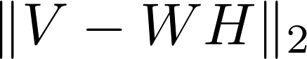

## Topic Modeling: Finding latent topics in NYT articles with NMF

For this assignment, we will apply the NMF algorithm to a corpus of NYT articles to discover latent topics.  The NYT _sections_ are certainly helpful, but we'd like to know more about the patterns found in the _contents_ of the NYT articles.  Let's use NMF to see what insights we can mine out of the article _contents_!

### Preliminaries

1. Read the [data/articles.pkl](data/articles.pkl) file using the `read_pickle` function in pandas. Look at the result and understand the structure of your data. Once you are comfortable with the data, store the 'content' series you read in, as this is what we will be working with for the rest of the assignment.

2. Use the [CountVectorizer](http://scikit-learn.org/stable/modules/generated/sklearn.feature_extraction.text.CountVectorizer.html)or the [TfidfVectorizer](http://scikit-learn.org/stable/modules/generated/sklearn.feature_extraction.text.TfidfVectorizer.html) from scikit-learn to turn the content of the news stories into a document-term matrix.  Choose a reasonable value (like 5000) for `max_features` when instantiating the vectorizer. Store your document-term matrix in a variable named `X` for later use. **Hint:** Check the `type` of `X`. Make `X` and `np.ndarray` if it isn't already.

3. Use the `get_feature_names` method of your vectorizer to obtain the word represented by each column of your document-term matrix. Store these feature names in a variable named `vocabulary` for later use.

### Implementing your own NMF class

We will now implement the NMF algorithm so that we can later use it to mine the NYT document-term matrix. We will implement our NMF algorithm in a Python class, following some of the conventions used by scikit-learn.

1. Declare a class named `NMF` in a new module named `my_nmf.py`. Don't forget to write a docstring for your class.

2. Declare the `__init__` method, and have it accept the parameters: __k__ (# of latent topics) and __max_iters__ (the maximum # of iterations to perform). Store these two parameters as member variables. Don't forget to write a docstring for your `__init__` method.

3. Declare the `fit` method, and have it accept __V__ (the input feature matrix) as a parameter. The `fit` method is where the NMF algorithm will be implemented; i.e., it is in the `fit` method that you will factorize the input matrix __V__ into the matrices __W__ and __H__.

 Let the shape of __V__ be __n x m__. Later we will pass the NYT document-term matrix as __V__, meaning __n__ will be the number of NYT articles in our corpus (1405), and __m__ will be the size of the vocabulary (5000 if you followed our suggestion above).

 The `fit` method should do the following:

  1. Instantiate __W__ (the weights matrix) having shape __n x k__ and filling it with positive random values.

  2. Instantiate __H__ (the feature matrix) having shape __k x m__ and filling it with positive random values.

  3. Our cost function will be RSS of the reconstruction of __V__, more precisely:  (see [Matrix norms](https://en.wikipedia.org/wiki/Matrix_norm)) That means we can us numpy's least squares solver to fit __W__ and __H__; import numpy's least squares solver at the top of your module with the line `from numpy.linalg import lstsq`.

  4. Update __H__ by calling `lstsq`, holding __W__ fixed. After the call to `lstsq`, clip all the values in __H__ to be non-negative (i.e. set all the negative values of __H__ to zero).

  5. Update __W__ by calling `lstsq`, holding __H__ fixed. After the call to `lstsq`, clip all the values in __W__ to be non-negative (i.e. set all the negative values of __W__ to zero). **Hint:** The `lstsq` solver assumes it is optimizing the right matrix of the multiplication (e.g. __x__ in the equation __Ax=b__). So you will need to get creative so you can use it to solve for __W__ and have the dimensions line up correctly. Brainstorm on paper or a whiteboard how to manipulate the matrices so that `lstsq` can get the dimensionality correct and optimize __W__. __Hint: it involves transposes.__

  6. Repeat steps 4 and 5 for a fixed number of iterations (`max_iters` from `__init__`), or until convergence.

  7. Return the computed weights matrix and features matrix.

  8. Don't forget to write a docstring for your `fit` method.

4. Declare and implement a method that returns the RSS of the reconstruction: . We'll use this method later to see how the RSS is affected by modifying various inputs.

### Using Your NMF Function

1. Now that you've written your NMF class, you should be able to use it to mine hidden topics in the NYT articles. You should be able to do so with code like this: (you pick `k`)
```python
from my_nmf import NMF
factorizer = NMF(k=??, max_iters=35)
W, H = factorizer.fit(X)
```

2. Using `np.argsort` on each topic in __H__, find the indices of the words most associated with that topic. Look-up which words those indices reference by peeking into your `vocabulary` variable.

3. Study the words you found in the step above to figure out what pattern each latent topic is capturing in the corpus. Try to add a _title_ (i.e. _label_) to each latent topic. If you don't find topics which make sense, try changing `k` and/or your method for vectorizing (e.g. try TfIdf if you are currently using Bag-of-Words).

### Built-In NMF

1. Use [sklearn's NMF implementation](http://scikit-learn.org/stable/modules/generated/sklearn.decomposition.NMF.html) to compute the [Non-Negative Matrix factorization](http://scikit-learn.org/dev/auto_examples/applications/topics_extraction_with_nmf_lda.html) of our documents.  Explore what "topics" are returned.

2. How close are the topics to what you found using your own NMF implementation?

3. Can you add a title to each latent topic representing the words it contains?

4.  Now that you have labeled the latent features with what topics they represent, explore strongest latent features for a few articles.  Do these make sense given the article? You will have to go back to the raw data you read in to do this.

5. How do the NYT _sections_ compare to the topics from the unsupervised learning?  What are the differences?  Why do you think these differences exist?

#### Extra:

1. Define a function that displays the headlines/titles of the top 10 documents for each topic.

1. Define a function that takes as input a document and displays the top 3 topics it belongs to.

1. Define a function that ensure consistent ordering between your NMF class and the sklearn NMF class.
